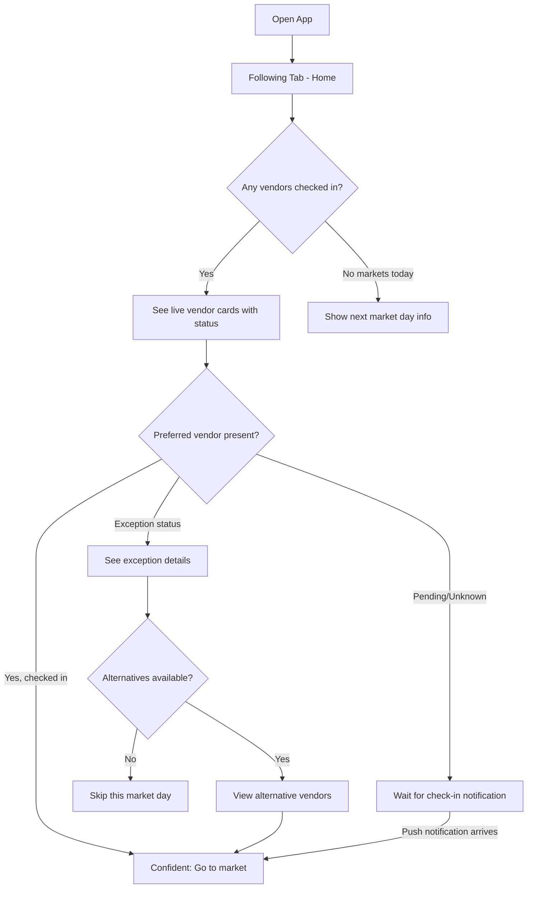
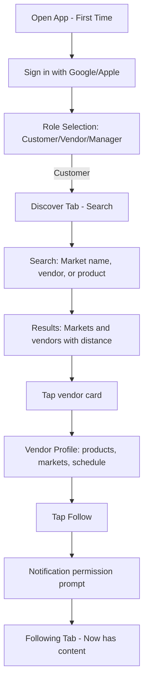
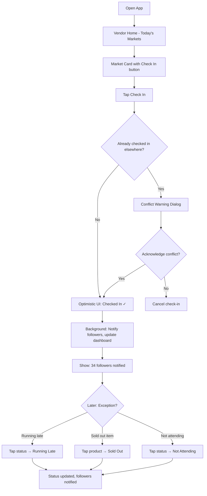
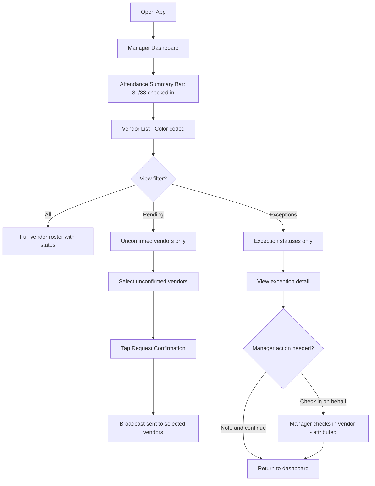
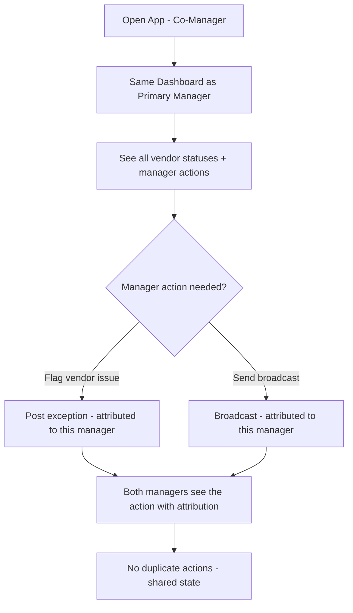

# UX Design Specification markets

**Author:** Human
**Date:** 2026-03-21

---

## Executive Summary

### Project Vision

**markets** is a real-time coordination platform for local farmers markets that replaces fragmented, manual communication workflows with a unified operational source of truth. The product serves three actor roles — customers, vendors, and market managers — creating a coordination flywheel where each actor's action creates value for the others.

The UX vision is **confidence-first**: every design decision prioritizes reducing customer uncertainty, minimizing vendor friction, and consolidating manager operations. The app competes on *failed-trip reduction* and evidence-backed availability signals, not engagement metrics or listing counts.

### Target Users

**Rachel (Customer)** — Health-conscious weekly market shopper. Tech-comfortable but time-constrained. Uses the app to confirm vendor presence and product availability before traveling. Needs fast, trustworthy answers to "Is my vendor there today?" and "Do they have what I want?" Currently cobbles together information from Instagram posts and word of mouth.

**Brad (Vendor)** — Multi-market organic produce vendor attending 5+ markets weekly. Needs tools that take less than 10 seconds to use during the chaos of market setup. Not interested in social media management — wants direct customer visibility that converts to foot traffic. Currently texts managers individually and posts to Instagram hoping followers see it.

**Maria/Juan (Market Managers)** — Manages 30-40 vendors across Saturday markets. Drowning in text messages and phone calls on market mornings. Needs a consolidated attendance dashboard, not another communication channel. Shared management (co-managers) is essential for real-world market operations.

### Key Design Challenges

1. **Outdoor mobile constraints** — Markets are outdoor venues with bright sunlight, unreliable cellular signal, and vendors whose hands are full. Every interaction must work in degraded conditions.
2. **Sub-10-second vendor actions** — Vendor adoption lives or dies on friction. If check-in takes longer than texting "I'm here" to a manager, vendors won't use it.
3. **Three-role navigation** — One app serves fundamentally different workflows for customers (discovery), vendors (status publishing), and managers (operational oversight). Role-based routing must feel like three purpose-built apps.
4. **Trust UX without complexity** — Freshness timestamps, check-in status, and exception states must convey confidence without cluttering the interface. Information density must be carefully balanced.
5. **Cold-start bootstrapping** — Early markets will have incomplete vendor rosters. The UX must gracefully handle sparse data without feeling empty or broken.

### Design Opportunities

1. **One-tap check-in as signature interaction** — A single, satisfying tap that triggers a cascade of value (follower notifications, dashboard updates, customer confidence) can become the product's defining moment.
2. **Exception-first vendor UX** — By defaulting vendors to "attending as planned" and only requiring action when something changes, the product dramatically reduces maintenance burden compared to competitors that require proactive status management.
3. **Confidence signals as competitive moat** — Freshness timestamps ("checked in 14 min ago") and live attendance indicators create a trust layer no competitor currently provides.
4. **Market-day anticipation** — Push notifications that convert passive followers into active market-goers ("Green Valley Farm just checked in at Riverside Market") create a Pavlovian engagement loop tied to real-world purchasing.

---

## Core User Experience

### Defining Experience

The defining experience of **markets** is: **"Confirm and go."**

For customers: open the app, see live vendor status, make a confident go/no-go decision, and head to the market knowing exactly what to expect. The entire flow from app open to decision should take under 30 seconds.

For vendors: arrive at market, tap one button to check in, and know that followers are being notified automatically. Under 10 seconds from pocket to done.

For managers: open the dashboard, see consolidated attendance at a glance, and identify gaps without making a single phone call. Under 5 seconds to situational awareness.

### Platform Strategy

- **Primary platform:** iOS and Android via React Native/Expo (shared codebase)
- **Secondary platform:** Web via React Native for Web (same codebase, deferred SEO optimization)
- **Touch-first design:** All interactions designed for thumb-zone reachability on mobile
- **Offline-resilient:** Optimistic UI with MMKV queue for vendor actions; graceful degradation in low-signal outdoor environments
- **Device capabilities leveraged:** Push notifications (critical for follower alerts), location services (future: proximity-based market discovery)

### Effortless Interactions

| Interaction | Target Effort | Design Approach |
|---|---|---|
| Vendor check-in | One tap, <10 seconds | Prominent check-in button on vendor home, optimistic UI, no confirmation dialog |
| Customer status check | Glance, <5 seconds | Live status indicators visible on followed vendor cards without tapping in |
| Manager attendance view | Glance, <3 seconds | Dashboard shows checked-in/pending/absent counts at top level |
| Following a vendor | One tap | Heart icon on vendor and market cards (empty = not following, filled = following, Instagram convention); no account setup gates |
| Exception status update | Two taps, <10 seconds | Quick-select from predefined states (running late, sold out, not attending) |

### Critical Success Moments

1. **Customer's first successful "confirm and go"** — Rachel sees her vendor is checked in, drives to market, finds them exactly as expected. This is the aha moment that creates a weekly habit.
2. **Vendor's first follower notification conversion** — Brad checks in, sees "3 followers notified," and later has a customer say "I came because I saw you checked in." This connects the app to revenue.
3. **Manager's first "prepared Saturday"** — Maria opens her dashboard at 7am and sees 31/38 vendors confirmed without making a single call. This is the operational relief that drives manager evangelism.

### Experience Principles

1. **Speed over polish** — Every screen must load fast and every action must complete instantly. Perceived performance is more important than visual richness. Skeleton screens, optimistic updates, and progressive loading are mandatory.
2. **Confidence over engagement** — The app's job is to give users a confident answer and get out of the way. We measure success by trips taken, not time in app. Resist the urge to add engagement features that don't serve the coordination mission.
3. **Exception-first, not status-first** — Vendors maintain a baseline that persists. They only need to act when something changes. The system assumes attendance unless told otherwise. This is the key adoption driver.
4. **Glanceable truth** — Every piece of status information must be interpretable in under 2 seconds. Use visual hierarchy, color coding, and iconography to convey meaning at a glance. Minimize text where icons suffice.
5. **Graceful degradation** — The app must remain useful in poor connectivity. Queued actions, cached data with staleness indicators, and retry-on-reconnect are not edge cases — they are primary design requirements for outdoor market environments.

---

## Desired Emotional Response

### Primary Emotional Goals

| Role | Primary Emotion | Description |
|---|---|---|
| Customer | **Confidence** | "I know exactly what to expect before I leave home" |
| Vendor | **Empowerment** | "I'm visible to customers without extra work" |
| Manager | **Preparedness** | "I can see everything at a glance — I feel organized and in control" |

### Emotional Journey Mapping

**Customer (Rachel):**
- **Discovery:** Curiosity and hope — "This might solve my wasted trip problem"
- **First search:** Satisfaction — "I can see who's actually there today"
- **First follow:** Connection — "I'll know next time automatically"
- **First notification → trip:** Delight — "This just works. I'm never going back to guessing"
- **Vendor not attending:** Brief disappointment → resolution — "There's an alternative nearby"

**Vendor (Brad):**
- **Onboarding:** Cautious optimism — "Is this worth my time?"
- **First check-in:** Surprise at simplicity — "That's it? One tap?"
- **First follower notification:** Validation — "People actually want to know when I'm here"
- **First customer attribution:** Excitement — "This app is making me money"

**Manager (Maria):**
- **First dashboard view:** Relief — "I can finally see everything in one place"
- **Vendor confirmation flow:** Calm efficiency — "Three taps and I've pinged all unconfirmed vendors"
- **Disruption alert:** Informed control — "I see the issue and can handle it without panic"

### Micro-Emotions

| Emotion Pair | Design Implication |
|---|---|
| Confidence vs. Confusion | Clear status hierarchy with unambiguous visual indicators; no ambiguous states |
| Trust vs. Skepticism | Freshness timestamps on every status claim; "Updated 3 min ago" builds trust |
| Accomplishment vs. Frustration | Optimistic UI with immediate visual feedback; vendor check-in feels instantly rewarding |
| Belonging vs. Isolation | Follow counts and notification patterns create community connection |
| Calm vs. Anxiety | Manager dashboard presents information without alarm; exception states are informational, not alarming |

### Design Implications

- **Color palette must support trust:** Greens for confirmed/present, warm neutrals for pending, muted reds for absent/exceptions — not alarming reds
- **Typography must convey reliability:** Clean, professional typefaces that feel informational rather than playful
- **Animations should be purposeful:** Check-in confirmation animation should feel satisfying but fast; no gratuitous motion
- **Empty states must feel optimistic:** Sparse market data should feel like "getting started" not "broken"
- **Error states must feel recoverable:** "Check-in pending — will retry automatically" not "Error: network timeout"

### Emotional Design Principles

1. **Reduce anxiety, don't create it** — Never show alarming UI states. Exception statuses are neutral information, not emergencies.
2. **Reward action immediately** — Every user action gets instant visual feedback. Vendor check-in animates a satisfying confirmation. Customer follow shows the count increment.
3. **Build trust incrementally** — Freshness timestamps, check-in histories, and consistent reliability create compounding trust over weeks of use.
4. **Celebrate community** — Follower counts, "X vendors checked in" counters, and market activity feeds create a sense of belonging to a local food community.

---

## UX Pattern Analysis & Inspiration

### Inspiring Products Analysis

**1. Uber/Lyft — Real-Time Status Tracking**
- Maps real-time location and ETA to a trust-building status display
- Lesson: Live status with time context ("arriving in 3 min") converts uncertainty to confidence
- Transferable: Vendor check-in timestamps with relative time ("checked in 14 min ago") serve the same psychological function

**2. OpenTable — Confirm and Go**
- Users confirm availability, then act with confidence
- Lesson: The value is in the confirmation, not the content browsing. Keep the confirmation path short.
- Transferable: Customer flow should prioritize "Is my vendor there?" over "Browse all vendors"

**3. Slack — Presence Indicators**
- Simple green/yellow/red dots convey status at a glance without text
- Lesson: Iconographic status is faster than text-based status
- Transferable: Vendor status indicators (checked in, running late, not attending) should use color + icon, readable at a glance

**4. Square/Toast — Vendor-Side Simplicity**
- POS systems designed for speed under pressure (customer waiting, line building)
- Lesson: Vendor tools must be operationally fast, not feature-rich. One action, one screen.
- Transferable: Vendor check-in and status update should be single-screen, single-tap workflows

### Transferable UX Patterns

**Navigation Patterns:**
- Bottom tab navigation with role-specific tabs (proven mobile pattern from Instagram, Uber)
- Tab switching based on authenticated role — customer sees Discover/Following/Profile, vendor sees Markets/Status/Profile, manager sees Dashboard/Vendors/Profile

**Interaction Patterns:**
- Pull-to-refresh for real-time data (universal mobile pattern)
- Swipe actions on list items for quick follow/unfollow (Mail, Slack)
- Optimistic UI updates with subtle pending indicators (Slack message sending)

**Status Patterns:**
- Traffic-light status indicators (green = present, yellow = exception, gray = pending)
- Relative time display ("14 min ago") rather than absolute timestamps
- Badge counts for unresolved items (manager pending vendor count)

### Anti-Patterns to Avoid

- **Feed-first design** — Do not make the home screen a social feed. This is a coordination tool, not a social network. Status should be structured, not scrollable.
- **Over-notification** — Do not notify customers of every status change. Notify on check-in and critical exceptions only. Avoid notification fatigue.
- **Complex onboarding** — Do not gate core functionality behind profile completion. Let vendors check in with minimal profile; let customers search without an account.
- **Desktop-first responsive** — Do not design for desktop and scale down. This is mobile-first with desktop as secondary.
- **Review/rating systems** — Do not add subjective feedback mechanisms. Trust is built through operational data (attendance, freshness), not opinions.

### Design Inspiration Strategy

**Adopt:**
- Bottom tab navigation with role-based tab sets
- Pull-to-refresh for real-time data
- Traffic-light status indicators for vendor presence
- Relative time freshness display

**Adapt:**
- Uber's real-time tracking → vendor check-in status propagation
- OpenTable's confirmation flow → customer "confirm and go" decision support
- Slack's presence dots → vendor attendance indicators

**Avoid:**
- Social media feed patterns (Instagram-style scrolling)
- Complex onboarding wizards
- Desktop-first layouts scaled down to mobile
- Gamification or engagement hooks that don't serve coordination

---

## Design System Foundation

### Design System Choice

**Gluestack UI v3** (`@gluestack-ui/nativewind`) — a themeable, accessible component system built on NativeWind (Tailwind CSS for React Native).

### Rationale for Selection

1. **Native NativeWind integration** — The architecture decision document specifies NativeWind v4 for styling. Gluestack v3 is built directly on NativeWind, eliminating style system conflicts.
2. **React Native-first** — Unlike web-first component libraries adapted for mobile, Gluestack is designed for React Native from the ground up, ensuring proper touch targets, gesture handling, and platform-native behavior.
3. **Accessibility built-in** — Gluestack components include proper ARIA labels, keyboard navigation, and screen reader support out of the box, directly supporting the WCAG 2.1 AA requirement from the PRD.
4. **Themeable via CSS variables** — Design tokens are defined as CSS variables in `config.ts`, mapped to Tailwind classes in `tailwind.config.js`. This supports light/dark mode and brand customization.
5. **CLI-based component management** — Components are added individually via `npx gluestack-ui add [component]`, keeping the bundle lean.

### Implementation Approach

- Initialize with `npx gluestack-ui init` in the Expo project
- Add components incrementally as screens are built
- Customize theme tokens in `components/gluestack-ui-provider/config.ts`
- Map tokens to Tailwind in `tailwind.config.js` for consistent utility class usage
- Use `tva()` (Tailwind Variant Authority) for component variant styling
- Extend Gluestack base components for domain-specific composed components

### Customization Strategy

- **Token-level customization:** Override Gluestack's default color palette, typography scale, and spacing to match the Markets brand
- **Component composition:** Build domain components (VendorCard, MarketHeader, CheckInButton, StatusBadge) by composing Gluestack primitives (Box, Text, Button, Badge, HStack, VStack)
- **Variant-driven design:** Use `tva()` to create semantic variants (e.g., StatusBadge with variants: "checked-in", "running-late", "not-attending", "pending")
- **No ejection:** Stay within Gluestack's theming system; do not fork or patch components

---

## 2. Core User Experience

### 2.1 Defining Experience

**"One tap to truth."**

The product's defining interaction is the **vendor check-in**: a single tap that transforms uncertainty into confidence across the entire system. When Brad taps "Check In":

1. His status instantly updates to "Present" (optimistic UI)
2. His 34 followers receive push notifications within 60 seconds
3. Maria's manager dashboard shows one more green dot
4. Rachel sees "Green Valley Farm — checked in 3 min ago" and grabs her bag

This single action creates value for every actor in the system. The UX must make this tap feel effortless, satisfying, and immediately impactful.

### 2.2 User Mental Model

**Customers think in terms of trips:** "Should I go to the market today?" The app must answer this question in under 30 seconds. They don't want to browse — they want to confirm.

**Vendors think in terms of setup routine:** Check-in is one step in a physical routine (park truck → unload → set up stall → open for business). The app must fit into this flow without interrupting it. One hand, one tap, done.

**Managers think in terms of roster status:** "How many vendors are here? Who's missing? Any issues?" They scan for exceptions, not for successes. The dashboard must surface gaps and problems, not enumerate what's working.

### 2.3 Success Criteria

| Criterion | Measurement |
|---|---|
| Vendor check-in completes in <10 seconds | Time from app open to confirmation animation |
| Customer confirms vendor status in <30 seconds | Time from app open to confident go/no-go decision |
| Manager achieves situational awareness in <5 seconds | Time from dashboard open to understanding attendance state |
| Zero ambiguous status states | Every vendor has a clear, unambiguous status at all times |
| Offline actions complete without error | Optimistic UI + retry queue handles connectivity gaps |

### 2.4 Novel UX Patterns

The product primarily uses **established patterns in a novel combination**:

- **Established:** Bottom tabs, pull-to-refresh, follow/unfollow, push notifications, search with filters
- **Novel combination:** Real-time attendance tracking + follower notifications + exception-first status management in a coordinated three-role system
- **Novel interaction:** Exception-first vendor status — the system assumes attendance by default, flipping the typical "opt-in to confirm" pattern to "opt-out on exception"

**Teaching strategy:** No onboarding tutorial needed. Vendor home screen shows a prominent "Check In" button for the next market. Customer search works like any search. Manager dashboard uses familiar table/list patterns. The novelty is in the coordination effect, not the interaction patterns.

### 2.5 Experience Mechanics

**Vendor Check-In Flow:**

1. **Initiation:** Vendor opens app → sees "Today's Markets" card with prominent "Check In" button for their next scheduled market
2. **Interaction:** Single tap on "Check In" button
3. **Conflict check:** If already checked in elsewhere, system shows warning with forced acknowledgment
4. **Feedback:** Button animates to "Checked In ✓" with green confirmation; haptic feedback; timestamp appears ("just now")
5. **Background:** System sends push to followers, updates Firebase Realtime, writes audit log
6. **Completion:** Vendor sees follower notification count update ("34 followers notified")

**Customer Confirm-and-Go Flow:**

1. **Initiation:** Customer opens app → sees "Following" tab with live status of followed vendors
2. **Glance:** Each vendor card shows status icon + freshness timestamp
3. **Decision:** Green status = go; exception status = check alternatives
4. **Action:** If exception → tap vendor → see alternative vendors at same market
5. **Completion:** Customer has confident go/no-go decision

**Manager Dashboard Flow:**

1. **Initiation:** Manager opens app → sees dashboard with attendance summary bar (31/38 checked in)
2. **Scan:** Color-coded vendor list — green (present), yellow (exception), gray (pending)
3. **Action on gaps:** Tap "Pending" filter → see unconfirmed vendors → tap "Request Confirmation" to broadcast
4. **Exception handling:** Exception alerts surface at top of feed with vendor name and status
5. **Completion:** Manager has full situational awareness and can act on gaps

---

## Visual Design Foundation

### Color System

**Brand Palette:**

The color system communicates operational status through an earthy, natural palette that reflects the farmers market domain while maintaining WCAG 2.1 AA contrast compliance.

| Token | Purpose | Light Mode | Dark Mode |
|---|---|---|---|
| `--color-primary-500` | Brand primary (CTAs, links) | `#2D7D46` (Forest Green) | `#4CAF6E` |
| `--color-primary-600` | Primary hover/pressed | `#1E6B35` | `#3D9A5E` |
| `--color-primary-100` | Primary subtle backgrounds | `#E8F5EC` | `#1A3D25` |
| `--color-secondary-500` | Secondary actions | `#8B6914` (Harvest Gold) | `#C4A135` |
| `--color-background-0` | Base background | `#FFFFFF` | `#121212` |
| `--color-background-50` | Card/surface background | `#F8F9FA` | `#1E1E1E` |
| `--color-background-100` | Elevated surface | `#F1F3F5` | `#2A2A2A` |
| `--color-text-900` | Primary text | `#1A1A1A` | `#F5F5F5` |
| `--color-text-600` | Secondary text | `#6B7280` | `#9CA3AF` |
| `--color-text-400` | Tertiary/muted text | `#9CA3AF` | `#6B7280` |

**Semantic Status Colors:**

| Token | Status | Color | Rationale |
|---|---|---|---|
| `--color-status-present` | Checked in / Present | `#22C55E` (Green) | Universal "good/active" signal |
| `--color-status-exception` | Running late / Low stock | `#F59E0B` (Amber) | Warning without alarm |
| `--color-status-absent` | Not attending | `#94A3B8` (Slate Gray) | Neutral absence, not alarming red |
| `--color-status-sold-out` | Sold out | `#EF4444` (Red) | Clear unavailability signal |
| `--color-status-pending` | Unconfirmed | `#D1D5DB` (Light Gray) | Awaiting information |
| `--color-success` | Success feedback | `#16A34A` | Action confirmation |
| `--color-error` | Error feedback | `#DC2626` | Error states |
| `--color-warning` | Warning feedback | `#D97706` | Caution states |
| `--color-info` | Informational | `#2563EB` | Neutral information |

### Typography System

**Font Selection:**

- **Primary (headings + body):** System font stack — San Francisco (iOS), Roboto (Android). No custom fonts for MVP. Faster load, platform-native feel, excellent readability.
- **Numeric display:** Tabular figures for timestamps and counts (vendor count "31/38", freshness "14 min ago")

**Type Scale (Gluestack defaults, customized):**

| Token | Size | Weight | Usage |
|---|---|---|---|
| `heading-xl` | 28px | Bold (700) | Screen titles |
| `heading-lg` | 22px | SemiBold (600) | Section headers |
| `heading-md` | 18px | SemiBold (600) | Card titles, vendor names |
| `body-lg` | 16px | Regular (400) | Primary body text |
| `body-md` | 14px | Regular (400) | Secondary text, descriptions |
| `body-sm` | 12px | Regular (400) | Captions, timestamps, metadata |
| `label-md` | 14px | Medium (500) | Button text, form labels |
| `label-sm` | 12px | Medium (500) | Badge text, status labels |

**Outdoor readability:** Minimum 14px for interactive text, 12px for metadata only. High contrast ratios (7:1 for primary text in bright-light mode).

### Spacing & Layout Foundation

**Spacing Scale (4px base, Tailwind default):**

| Token | Value | Usage |
|---|---|---|
| `space-1` | 4px | Tight padding (icon-to-text gap) |
| `space-2` | 8px | Component internal padding |
| `space-3` | 12px | Between related elements |
| `space-4` | 16px | Card padding, section gaps |
| `space-5` | 20px | Between sections |
| `space-6` | 24px | Major section separation |
| `space-8` | 32px | Screen-level padding |

**Layout Principles:**

- **Card-based UI:** All content organized in cards with `space-4` (16px) padding and `rounded-xl` (16px) corners
- **Safe area aware:** Respect device safe areas (notch, home indicator) on all screens
- **Thumb-zone design:** Primary actions in bottom 60% of screen; navigation tabs at bottom
- **Touch targets:** Minimum 44x44px for all interactive elements; 48x48px for primary actions

### Accessibility Considerations

- **Color contrast:** All text meets WCAG 2.1 AA (4.5:1 for normal text, 3:1 for large text). Status colors are paired with icons — never color-only.
- **Screen readers:** All status changes announced via `accessibilityLiveRegion`. Vendor status cards include descriptive labels ("Green Valley Farm, checked in 14 minutes ago").
- **Motion:** Reduced motion preference respected. Confirmation animations degrade to instant state changes.
- **Touch targets:** All interactive elements minimum 44x44px. Check-in button is 56px tall for deliberate, confident tapping.
- **Focus management:** Keyboard/switch navigation supported for all critical flows (check-in, search, follow).

---

## Design Direction Decision

### Design Directions Explored

The design direction for **markets** balances three competing needs:

1. **Operational clarity** (manager dashboard) — Dense, information-rich, table-like layouts
2. **Consumer warmth** (customer discovery) — Inviting, visual, card-based browsing
3. **Vendor speed** (check-in) — Minimal, action-forward, one-tap interfaces

### Chosen Direction

**"Clean Utility with Organic Warmth"**

A clean, utility-focused interface with warm, earthy accents that evoke the farmers market aesthetic. Information hierarchy is strict — status indicators, freshness timestamps, and action buttons dominate. Photography and decorative elements are minimal. The palette (forest green + harvest gold + natural neutrals) grounds the app in its agricultural domain without feeling rustic or outdated.

### Design Rationale

- **Clean utility** ensures speed and glanceability for all three roles
- **Organic warmth** (rounded corners, earthy palette, generous white space) differentiates from cold enterprise tools
- **Status-forward layout** puts the coordination mission front and center
- **Role-adaptive density:** Customer screens use more white space and visual appeal; manager screens are denser and more data-forward; vendor screens are minimal and action-focused

### Implementation Approach

- Use Gluestack UI v3 components as base with custom theme tokens
- Card-based layout system with consistent spacing and corner radius
- Status badge component with semantic color variants
- Freshness timestamp component reused across all roles
- Bottom tab navigation with role-specific tab configurations
- No custom illustrations or complex graphics for MVP — rely on icons (lucide-react-native) and status indicators

---

## User Journey Flows

### Journey 1: Customer — Confirm and Go

**Entry:** Customer opens app (already authenticated, has followed vendors)

**Key UX requirements:**
- Following tab is default home screen for customers
- Vendor cards show: name, status icon, freshness timestamp, market name, primary products
- Exception states show inline alternative suggestions
- Pull-to-refresh updates all vendor statuses

### Journey 2: Customer — First-Time Discovery

**Entry:** New user opens app for first time

**Key UX requirements:**
- Sign-in is Google/Apple only — no forms, no passwords
- Role selection is a simple 3-option screen
- Location is determined automatically via device location services each time the app opens; no manual location setting in Customer Profile
- Search is the primary first-time action — prominent search bar
- Results show distance/radius filtering with Sort by Date option
- Markets display as recurring ("Saturdays, 8AM–1PM") or one-time ("June 14, 10AM–4PM") with start/end date ranges
- Market cards include a heart follow icon and link to a Market Detail screen (name, address, schedule, vendor count, social links)
- Follow action (heart icon) triggers notification permission at the right contextual moment
- Filter chips use `flex-wrap: wrap` — never horizontal scroll; when dozens of product filters exist, chips wrap to additional lines so all options remain visible

### Journey 3: Vendor — Market Day Check-In

**Entry:** Vendor arrives at market, opens app

**Key UX requirements:**
- The vendor Markets tab is the home screen, titled "Upcoming Markets", consolidating all market management (upcoming schedule, find/join, products)
- Check-in button is large (56px), green, and impossible to miss
- Conflict warning is a modal with clear acknowledge/cancel options
- Exception statuses are quick-selectable from a predefined list
- Follower notification count provides immediate reward feedback
- Vendor Status screen displays a Market Guidance summary (setup times, fees, policies) for the current market
- Vendor stat "Check-Ins" is renamed to "Markets Attended"
- Each upcoming market card is tappable and leads to a detail screen showing date, time, location, Market Guidance, and a Withdraw option
- Products management is accessible from the Markets tab (not buried in Profile)
- "Request to Join" leads to a dedicated date selection screen with Market Guidance acknowledgment
- Vendor Activity Log is a dedicated screen accessible from Profile settings

### Journey 4: Manager — Saturday Morning Dashboard

**Entry:** Manager opens app on market morning

**Key UX requirements:**
- Dashboard summary bar (checked-in/pending/exceptions count) is always visible at top
- Vendor list supports filter toggles (all / pending / exceptions); Exceptions filter shows only exception-state vendors
- Bulk "Request Confirmation" action for pending vendors
- Manager-on-behalf check-in shows attribution ("Riverside Market checked-in Green Valley Farm")
- Real-time updates via Firebase Realtime — dashboard refreshes without pull-to-refresh
- Plan Ahead supports switching between Product category coverage view and Vendor list view
- Plan Ahead includes Notify, Cancel Date (with strong warning/confirmation), and Add Date (with clone from previous) actions per date
- Send Notification screen includes a Vendors/Followers toggle; when Vendors selected, sub-filter for All/Confirmed/Pending
- Pending join requests are viewable from a dedicated screen (accessible from Vendors tab banner)
- "Market Rules" is renamed to "Market Guidance" throughout
- "Already rostered" label in Find & Invite Vendors is changed to "Already Joined"
- Market Settings screen (name, address, schedule, hours, site map image) is accessible from Manager Profile

### Journey 5: Co-Manager Shared Operations

**Entry:** Assistant manager opens app during active market

**Key UX requirements:**
- Co-managers see identical dashboard state
- All actions attributed with manager identity and timestamp
- No duplicate notifications — if one manager handles an issue, the other sees it resolved

### Journey Patterns

**Common Patterns Across Journeys:**

| Pattern | Implementation |
|---|---|
| Status indicators | Consistent icon + color + text across all roles |
| Freshness timestamps | Relative time ("14 min ago") on every status element |
| Pull-to-refresh | Available on all list/feed screens |
| Optimistic updates | All write actions show success immediately |
| Error recovery | "Pending..." state with automatic retry indicator |
| Empty states | Friendly illustration + actionable prompt ("Follow your first vendor") |

### Flow Optimization Principles

1. **Minimize taps to value:** Check-in = 1 tap. Search = type + tap. Follow = 1 tap.
2. **Front-load decisions:** Show the most critical information (status, freshness) without requiring a tap
3. **Progressive disclosure:** Summary first, details on tap — never overwhelm on first view
4. **Consistent escape hatches:** Every flow has a clear back/cancel path

---

## Component Strategy

### Design System Components

**From Gluestack UI v3 (used directly):**

| Component | Usage |
|---|---|
| `Box`, `VStack`, `HStack` | Layout containers |
| `Text`, `Heading` | Typography |
| `Button`, `ButtonText`, `ButtonIcon` | Primary and secondary actions |
| `Input`, `InputField` | Search, form inputs |
| `Avatar`, `AvatarImage` | Vendor and user avatars |
| `Badge`, `BadgeText` | Status badges |
| `Card` | Vendor cards, market cards |
| `Pressable` | Touchable areas |
| `Icon` | System icons (via lucide-react-native) |
| `Modal`, `ModalContent` | Confirmation dialogs, conflict warnings |
| `Toast` | Success/error feedback |
| `Skeleton` | Loading states |
| `Switch` | Toggle preferences |
| `Tabs` | Filter toggles (All/Pending/Exceptions) |
| `Divider` | Section separators |
| `Spinner` | Inline loading indicators |

### Custom Components

**StatusBadge** — Domain-specific status indicator

| Prop | Type | Values |
|---|---|---|
| `status` | enum | `checked-in`, `running-late`, `sold-out`, `not-attending`, `pending` |
| `size` | enum | `sm`, `md`, `lg` |
| `showTimestamp` | boolean | Whether to show freshness time |
| `timestamp` | string | ISO 8601 timestamp for freshness calc |

Anatomy: Icon + colored dot + status text + optional timestamp
States: Each status has a specific icon, background color, and text color
Accessibility: `accessibilityLabel` with full status description and time

---

**VendorCard** — Vendor summary card for lists and following feed

| Prop | Type | Description |
|---|---|---|
| `vendor` | Vendor | Vendor data object |
| `status` | VendorStatus | Current status with timestamp |
| `market` | Market | Market context |
| `onFollow` | function | Follow/unfollow callback |
| `onPress` | function | Navigate to vendor detail |

Anatomy: Avatar + Vendor Name + Market Name + StatusBadge + Product tags + Heart icon (follow/unfollow)
States: Default, followed (filled heart), loading, error
Variants: Compact (list item), expanded (following feed)

---

**CheckInButton** — Primary vendor check-in action

| Prop | Type | Description |
|---|---|---|
| `market` | Market | Market to check into |
| `isCheckedIn` | boolean | Current check-in state |
| `onCheckIn` | function | Check-in callback |
| `onCheckOut` | function | Checkout callback |

Anatomy: Large button (56px height) with icon + text
States: Ready ("Check In" - green), Checked In ("Checked In ✓" - muted green), Pending ("Checking in..." - gray), Error ("Retry" - amber)
Behavior: Optimistic update; haptic feedback on success

---

**AttendanceSummaryBar** — Manager dashboard header showing counts

| Prop | Type | Description |
|---|---|---|
| `total` | number | Total rostered vendors |
| `checkedIn` | number | Checked-in count |
| `pending` | number | Unconfirmed count |
| `exceptions` | number | Exception count |

Anatomy: Horizontal bar with three segments (green/gray/amber) + numeric labels
Behavior: Tapping a segment filters the vendor list below

---

**FreshnessTimestamp** — Relative time display with auto-update

| Prop | Type | Description |
|---|---|---|
| `timestamp` | string | ISO 8601 timestamp |
| `prefix` | string | Optional prefix ("checked in", "updated") |

Anatomy: Muted text showing relative time ("14 min ago", "just now", "2 hours ago")
Behavior: Auto-updates every 60 seconds; uses `body-sm` (12px) typography

---

**MarketCard** — Market summary for discovery and search results

| Prop | Type | Description |
|---|---|---|
| `market` | Market | Market data |
| `distance` | number | Distance in miles/km |
| `vendorCount` | number | Active vendor count |
| `onPress` | function | Navigate to market detail |
| `onFollow` | function | Follow/unfollow callback |

Anatomy: Market name + address + distance badge + vendor count + next market day (recurring or one-time) + Heart icon (follow/unfollow)
Tapping the card navigates to Market Detail screen (name, address, schedule, description, vendor count, social links, follow action)

---

**ExceptionStatusSelector** — Quick-select for vendor exception states

| Prop | Type | Description |
|---|---|---|
| `currentStatus` | enum | Current vendor status |
| `onSelect` | function | Status selection callback |

Anatomy: Bottom sheet with status options (Running Late, Sold Out item, Not Attending) each with icon + description
Behavior: Single tap selection → optimistic update → dismiss

---

**ActivityFeedItem** — Individual activity event in role-specific feeds

| Prop | Type | Description |
|---|---|---|
| `event` | ActivityEvent | Event data (actor, action, target, timestamp) |
| `variant` | enum | `customer`, `vendor`, `manager` |

Anatomy: Actor avatar + action description + target + FreshnessTimestamp

### Component Implementation Strategy

- Build with Gluestack primitives (Box, Text, HStack, VStack) and NativeWind classes
- Define variants using `tva()` for consistent styling
- Export from `components/{domain}/` directories
- Generate TypeScript types from GraphQL schema for all data props
- Co-locate tests with components

### Implementation Roadmap

**Phase 1 — Core (MVP launch blockers):**
- StatusBadge, VendorCard, CheckInButton, FreshnessTimestamp, MarketCard

**Phase 2 — Operations:**
- AttendanceSummaryBar, ExceptionStatusSelector, ActivityFeedItem

**Phase 3 — Enhancement:**
- Search result components, notification preference controls, audit trail viewer

---

## UX Consistency Patterns

### Button Hierarchy

| Level | Gluestack Variant | Usage | Example |
|---|---|---|---|
| **Primary** | `action="primary"` | One per screen; main action | "Check In", "Follow", "Search" |
| **Secondary** | `action="secondary"` | Supporting actions | "View All", "Edit Profile" |
| **Tertiary** | `variant="link"` | Inline actions, navigation | "See alternatives", "Manage notifications" |
| **Destructive** | `action="negative"` | Irreversible actions | "Remove Vendor", "Delete Account" |

**Rules:**
- Maximum one primary button per screen
- Destructive actions require confirmation modal
- Button text is action-verb-first ("Check In", "Follow Vendor", "Request Confirmation")

### Feedback Patterns

| Feedback Type | Component | Duration | Position |
|---|---|---|---|
| **Success** | Toast (green) | 3 seconds, auto-dismiss | Top of screen |
| **Error** | Toast (red) + retry action | Persistent until dismissed | Top of screen |
| **Warning** | Modal dialog | Until user action | Center overlay |
| **Info** | Inline text or banner | Persistent | In-context |
| **Loading** | Skeleton screen | Until data loads | In-place replacement |
| **Pending** | Inline indicator + text | Until resolved | In-context |

**Rules:**
- Never use spinners for initial loads — always skeleton screens
- Optimistic UI for all mutations — show success immediately
- Error messages are action-oriented: "Check-in failed. Tap to retry."
- Never show raw error messages or codes to users

### Form Patterns

- **Inline validation:** Validate on blur, not on keystroke
- **Error display:** Red border + error text below field
- **Required fields:** All fields required unless labeled "(optional)"
- **Search:** Debounced input (300ms) with loading indicator

### Navigation Patterns

**Bottom Tab Bar (role-specific):**

| Role | Tab 1 | Tab 2 | Tab 3 |
|---|---|---|---|
| Customer | Discover | Following | Profile |
| Vendor | Markets (titled "Upcoming Markets") | Status | Profile |
| Manager | Dashboard | Vendors | Profile |

**Rules:**
- Tab bar always visible (except during modals)
- Active tab indicated with primary color fill
- Badge count on tab for unread notifications
- Deep links open the correct tab and screen

### Additional Patterns

**Empty States:**
- Always include: illustration (simple line art), descriptive heading, actionable CTA
- Customer empty following: "You're not following any vendors yet" + "Discover Vendors" button
- Manager empty dashboard: "No vendors rostered yet" + "Add Vendors" button

**Customer Profile:**
- No manual location setting — location auto-detected via device location services
- Profile shows: Notifications, Product Preferences, Activity Log, Switch Mode, Delete Account

**Pull-to-Refresh:**
- Available on all list/feed screens
- Triggers Apollo Client `refetch`
- Shows native refresh indicator (platform-specific)

**List Virtualization:**
- All lists use FlashList for performance
- Vendor and market lists support infinite scroll where applicable

---

## Responsive Design & Accessibility

### Responsive Strategy

**Mobile (Primary — 320px-767px):**
- Single-column layout
- Bottom tab navigation
- Full-width cards
- Touch-optimized interactions (44px+ targets)
- Status information prioritized over detail

**Tablet (768px-1023px):**
- Two-column layout for manager dashboard (vendor list + detail panel)
- Customer discovery shows grid of vendor cards (2 columns)
- Tab navigation remains at bottom
- Increased information density

**Web/Desktop (1024px+ — via React Native for Web):**
- Max-width container (1200px) centered
- Three-column layout for manager (sidebar filters + vendor list + detail)
- Customer discovery shows wider card grid (3-4 columns)
- Navigation moves to top/side for web ergonomics (post-MVP optimization)

### Breakpoint Strategy

- **Mobile-first approach:** Design for 375px width (iPhone SE/13 mini) as baseline
- **Breakpoints via NativeWind:** `sm:` (640px), `md:` (768px), `lg:` (1024px), `xl:` (1280px)
- **Platform-specific adjustments:** Use `Platform.OS` for iOS/Android differences (safe areas, navigation bar height)

### Accessibility Strategy

**Target: WCAG 2.1 AA compliance for all critical flows**

**Critical Flows Requiring Full A11y:**
1. Authentication (sign in with Google/Apple)
2. Search and discovery (find vendors and markets)
3. Follow/unfollow vendors and markets
4. Vendor check-in and status update
5. Manager dashboard and attendance review

**Accessibility Implementation:**

| Requirement | Implementation |
|---|---|
| Screen reader support | `accessibilityLabel` on all interactive elements; `accessibilityRole` on semantic components |
| Live regions | `accessibilityLiveRegion="polite"` for status changes; `"assertive"` for errors |
| Color independence | All status indicators use icon + color + text — never color alone |
| Touch targets | Minimum 44x44px; primary actions 48x48px+ |
| Contrast ratios | 4.5:1 for normal text; 3:1 for large text; 3:1 for UI components |
| Keyboard navigation | Tab order follows visual order; focus indicators visible; skip links on web |
| Reduced motion | `prefers-reduced-motion` respected; animations degrade to instant transitions |
| Dynamic type | Font sizes respect system text size preferences (iOS Dynamic Type, Android font scale) |

### Testing Strategy

**Automated:**
- axe-core integration in CI for web builds
- React Native Testing Library for component accessibility assertions
- Contrast ratio validation in design token CI checks

**Manual:**
- VoiceOver (iOS) testing for all critical flows before each release
- TalkBack (Android) testing for all critical flows before each release
- Keyboard-only navigation testing on web
- Test with system font size set to maximum

**Device Testing:**
- iPhone SE (smallest supported) and iPhone 15 Pro Max (largest)
- Mid-range Android device (Pixel 7a or equivalent)
- iPad for tablet layout validation

### Implementation Guidelines

- Use Gluestack's built-in accessibility props — they handle most ARIA concerns
- Add `accessibilityLabel` to all custom composed components
- Test with screen readers during development, not as an afterthought
- Use `expo-haptics` for tactile feedback on primary actions (check-in confirmation)
- Ensure all status colors have accessible contrast ratios against both light and dark backgrounds
- Use `accessibilityHint` sparingly — only when the label alone is insufficient
